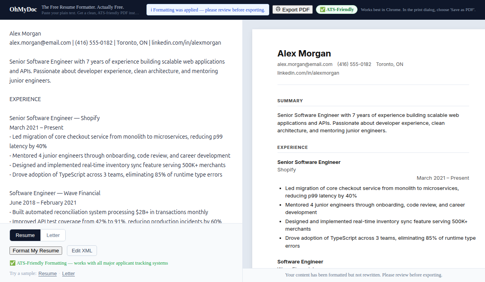

# OhMyDoc — Free Resume Formatter

**Paste your plain text. Get a clean, ATS-friendly PDF instantly.**

No login, no paywalls, no BS. Just format and download.

**[→ Try it now at ohmydoc.vercel.app](https://ohmydoc.vercel.app)**



## What It Does

1. **Paste** your resume or cover letter as plain text
2. **AI formats** it into clean, structured XML
3. **Preview** the formatted document in real-time
4. **Export** to PDF with one click

The output is ATS-friendly — works with all major applicant tracking systems.

## Supported Document Types

- **Resume** — professional formatting with sections for experience, education, skills
- **Cover Letter** — clean business letter layout

## Quick Start

```bash
git clone https://github.com/kimwwk/ohmydoc-using-claude-code-agent.git
cd ohmydoc-using-claude-code-agent

cp .env.example .env
# Add at least one API key to .env (see below)

npm install
npm run dev
```

Open [http://localhost:3000](http://localhost:3000) — you're ready to go.

### API Keys

Add at least one provider to your `.env` file:

| Provider | Key format | Required? |
|----------|-----------|-----------|
| Anthropic (Claude) | `sk-ant-api03-...` | Recommended |
| OpenAI | `sk-proj-...` | Optional |
| Google Gemini | `AIza...` | Optional |
| Perplexity | `pplx-...` | Optional |
| Mistral | — | Optional |
| Groq | — | Optional |
| OpenRouter | — | Optional |

See `.env.example` for all supported providers.

## How It Works

```
Plain Text → AI Formatting → XML → Template Rendering → HTML Preview → PDF Export
```

- **Input**: You paste unstructured text (your resume content)
- **AI Pipeline**: An LLM parses your text and structures it into XML with semantic sections
- **Template System**: Vue SFC templates render the XML into styled HTML
- **Export**: Browser print-to-PDF produces a clean, portable document

### Adding New Templates

Templates live in `/templates/{name}/` as Vue Single File Components. Each template:
- Receives parsed XML data as props
- Has its own scoped CSS (no framework dependencies — must be exportable)
- Can render the same data with completely different layouts

## Tech Stack

- **[Nuxt 4](https://nuxt.com)** (Vue 3) — app framework
- **AI Providers** — Anthropic Claude, OpenAI, Google Gemini, and more
- **DOMPurify** — HTML sanitization
- **Vercel** — hosting with automatic deploys

## Development

```bash
npm run dev          # Start dev server at localhost:3000
npm run build        # Build for production
npm run preview      # Preview production build
npm run lint         # Run ESLint
npm run lint:fix     # Auto-fix lint issues
```

## Debug Pages

Component demo pages are available at `/debug/*` routes:
- `/debug/parser` — XML parser testing
- `/debug/template` — Template rendering showcase
- `/debug/editor` — Editor component
- `/debug/preview` — Preview panel with error handling

## License

MIT
